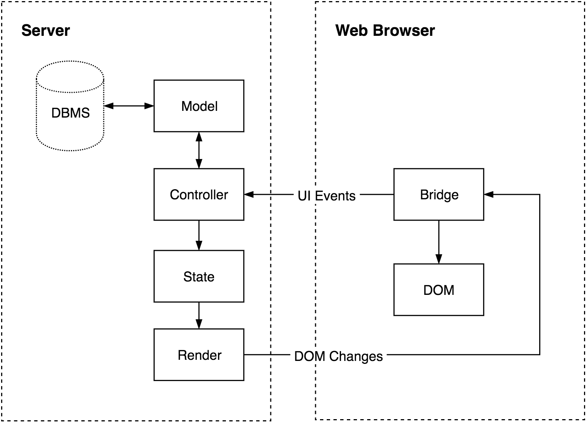

# Korolev


[](https://travis-ci.org/fomkin/korolev)
[](https://gitter.im/fomkin/korolev?utm_source=badge&utm_medium=badge&utm_campaign=pr-badge)
[-0088cc.svg)](https://telegram.me/korolev_io)

Not long ago we have entered the era of single-page applications. Some people say that we no longer need a server. They say that JavaScript applications can connect to DBMS directly. Fat clients. **We disagree with this.** This project is an attempt to solve the problems of modern fat web.

Korolev runs a single-page application on the server side, keeping in the browser only a bridge to receive commands and send events. The page loads instantly and works fast, because it does a minimal amount of computation. It's important that Korolev provides a unified environment for full stack development. Client and server are now combined into a single app without any REST protocol or something else in the middle.

Our project supports static page rendering, so that search engines can index pages and view them immediately.

## Browser support

[](https://saucelabs.com/u/yelbota)

## Principles

1. **Thin client.** Let's be honest, modern JavaScript applications are too greedy. Every JavaScript developer thinks that his page is special. But the user has a different opinion. He opens dozens of tabs. Each tab contains a ton of code, and this works very slowly. So we make our JavaScript bridge as lightweight as possible.

2. **Immutable and pure.** Really, we don't need mutability even on the frontend. Especially on the frontend. The majority of modern JavaScript frameworks are trying to be functional. And so are we.

3. **Rapid development.** Efficiency is everything. We are trying to make Korolev bullshit- and boilerplate-free. Hope our words are no bullshit.

## Quick Start

Add `korolev-server` to your `build.sbt`

```scala
libraryDependencies += "com.github.fomkin" %% "korolev-server-blaze" % "0.2.0"
```

Look at [examples](https://github.com/fomkin/korolev/tree/v0.2.0/examples). It updates very frequently, so we don't paste the code here, sorry guys.

## Architecture

### Summary
Every *session* has a *State*. When an *Event* happens, you can modify the *State* with a *Transition*. Every state *renders* to pseudo-HTML. The browser receives only a list of changes via WebSocket.



### State

Single source of truth as [Redux guys say](http://redux.js.org/docs/introduction/ThreePrinciples.html#single-source-of-truth). The only source of data to render a page. If you have something you want to display, it should be stored in *State*. Usually it is a sealed trait with several case classes corresponding to rendered screens. State should be immutable.

### Transition

A function that takes the current *State* and transforms it into a new *State*. This is the only way to modify a *State*.

### Event

You can subscribe to client-side DOM events. Event flow is similar to the [W3 standard](http://www.w3.org/TR/uievents/#event-flow). Event handlers produce *Transitions*.

## Running Examples

Just call this at shell:

```
git clone https://github.com/fomkin/korolev.git && cd korolev
./sbt simpleExample/run
```

After you will able to reach example app at `http://localhost:8181`
(you may do same for others samples like `routingExample`, `gameOfLifeExample`).

## Future plans

All features and changes are registered in the [issues](https://github.com/fomkin/korolev/issues). Our first goal is to ship a ready-to-use version with a semi-stable API.
